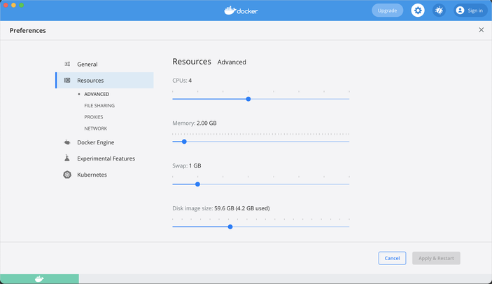

# Deploy Module - Running Local Nodes

### A) DeployNodes / Cordform Task - Single Net

```
./gradlew deployNodes
./deploy/build/nodes/runnodes
```
- Spawns local SINGLE NETWORK node instances with CRaSH interfaces via Xterm.
- Use and modify node blocks, for simple initial Cordapp testing

### B) Network PrepareDockerNodes / Dockerform Tasks - Multi Net

#### Prereqs:
1. [Docker Desktop or Docker *NIX](https://docs.docker.com/docker-for-mac/install/)
2. [Docker-Compose](https://docs.docker.com/compose/install/)

- IMPORTANT: Docker resources defaults in Docker Desktop for mac are too low. you have to
allocate a higher ram limit to support Corda nodes. If you have 16GB try setting to around
  10GB; systems with 32GB can go for more.
  

  

#### Prepare the docker-compose configurations

```shell
./gradlew prepareAllDockerNodes     # generate config for all networks
./gradlew prepareAuctionDockerNodes # config for Auction Network - Alice, Bob, Charlie
./gradlew prepareGbpDockerNodes     # config for GBP Network - Alice, Bob
./gradlew prepareCbdcDockerNodes    # config for CBDC Network - Alice, Charlie
```
- generates a docker compose file for associated networks

#### Up/Down the networks

```shell
# Using preset gradle tasks from terminal or IntelliJ

./gradlew allNetworksUp
./gradlew allNetworksDown

# Or using docker-compose direct commands

docker-compose -f <relative-path>/deploy/build/[Auction-Nodes|GBP-Nodes|CBDC-Nodes]/docker-compose.yml up -d
docker-compose -f <relative-path>/deploy/build/[Auction-Nodes|GBP-Nodes|CBDC-Nodes]/docker-compose.yml down --remove-orphans
```