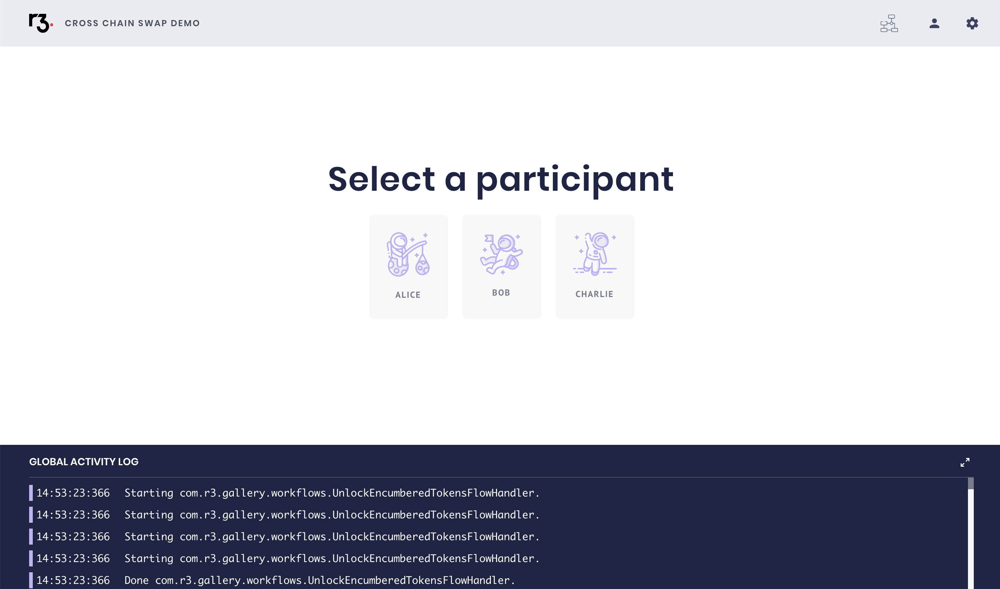
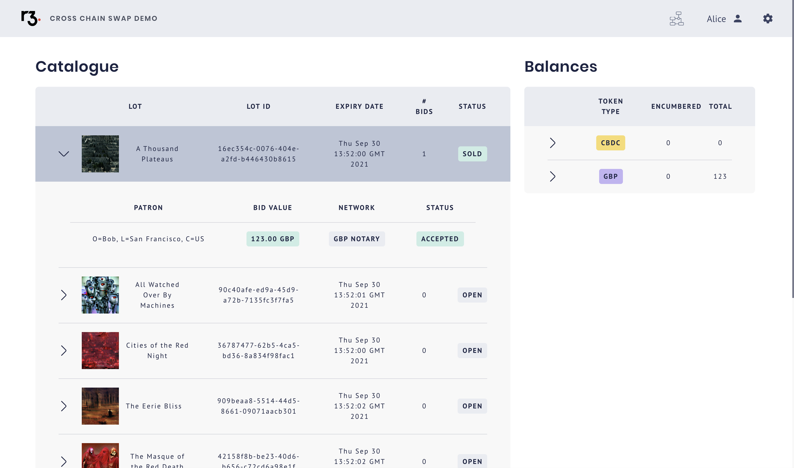
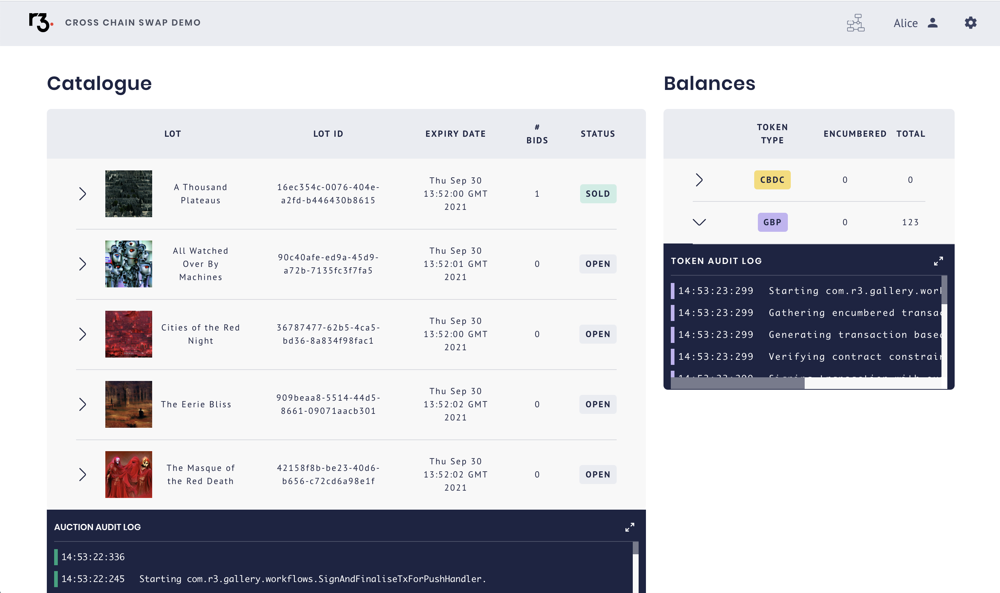
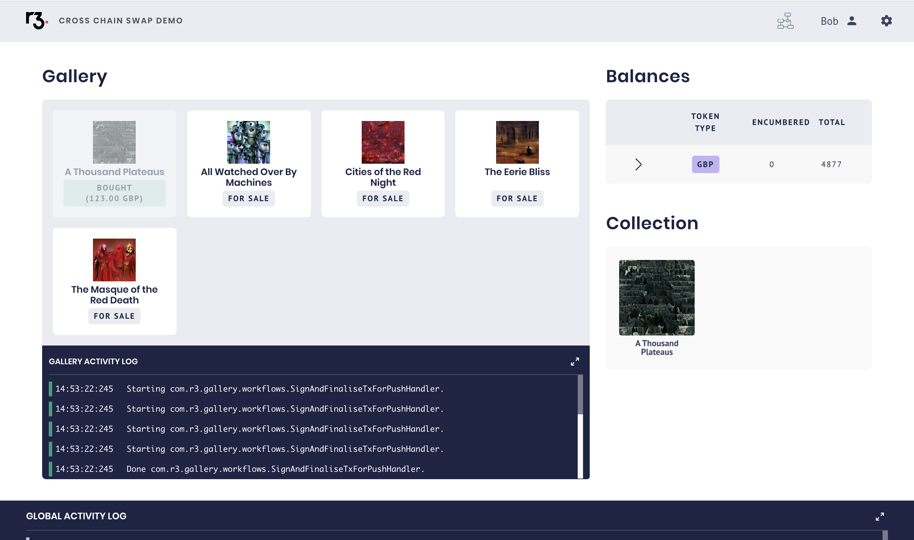
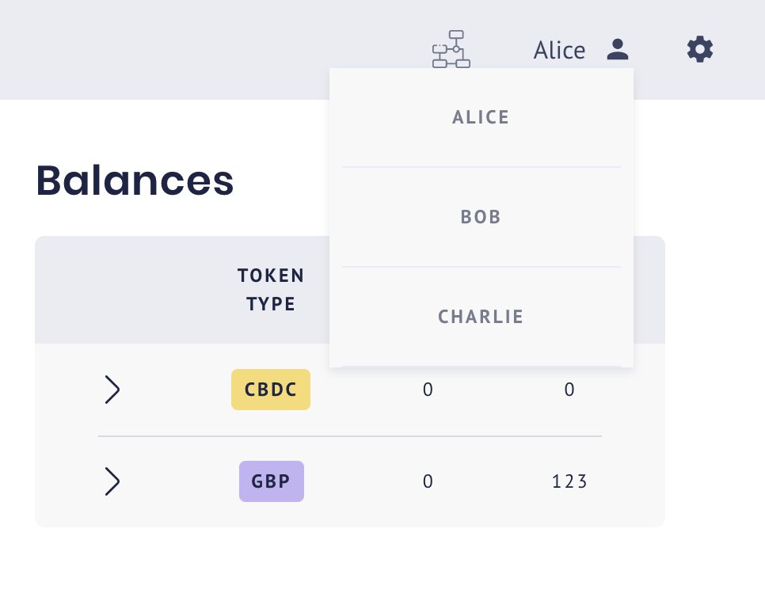
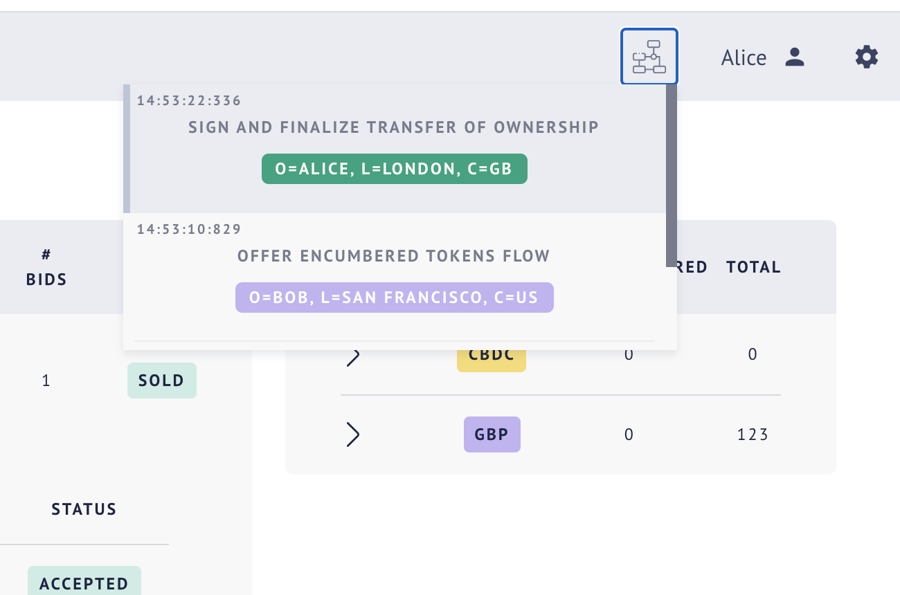
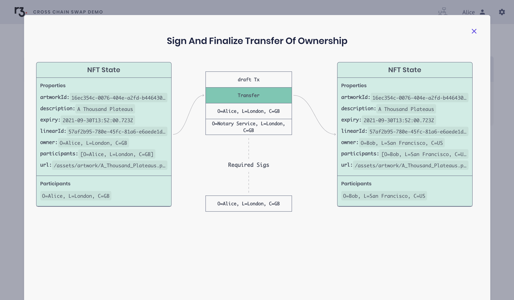

#Cross Chain Swaps Demo UI
The UI allows you to play the role of the participants in this demo. 
Placing bids on auction items and accepting them on behalf of the gallery owner.

## Getting Started
By default, the UI will point to a mockserver [http://localhost:1337](http://localhost:1337) which
can be launched with `npm run mock-api`. In order to change this you will need to set an environment variable `REACT_APP_API_HOST` 
to the appropriate location.

### `nvm use`
Normalise NPM & Node version 

### `npm install`
Retrieve dependencies

### `npm start`
Runs the app in the development mode.\
Open [http://localhost:3000](http://localhost:3000) to view it in the browser.

### `npm run build`
Builds the app for production to the `build` folder.\
It correctly bundles React in production mode and optimizes the build for the best performance.

The build is minified and the filenames include the hashes.\
Your app is ready to be deployed!

See the section about [deployment](https://facebook.github.io/create-react-app/docs/deployment) for more information.

## Screenshots
### Home Screen

### Auction Owner View

### Auction Owner View 2

### Bidder View

### Place Bid Modal

### Select User Menu

### View Flows Menu

### Flow Diagram

